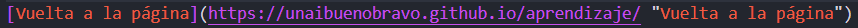
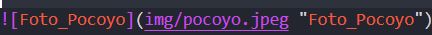
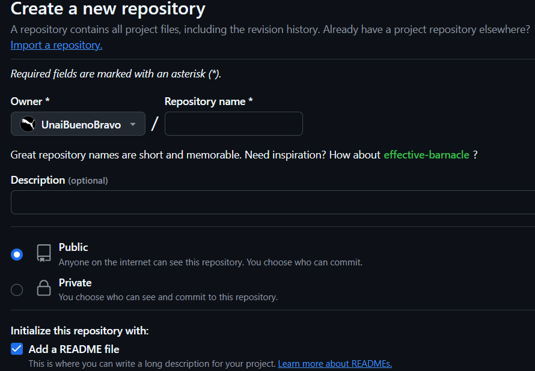
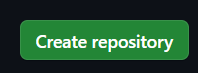

# Bienvenidos a la página de Apuntes de _"Llenguatge de marques"_

Unai Bueno Bravo

ASIX1

# Aprendizaje

# Aprendizaje_markdown
## Segundo nivel de encabezado
### Tercer nivel de encabezado
#### Cuarto nivel de encabezado
##### Quinto nivel de encabezado

Estos son los apuntes del *0373* del ciclo de _ASIX_ o **DAW** del curso __2425__

Primera clase **_markdown_** y HTML pueden anidarse

Para listar contenido des de markdown, tenemos diferentes formas de hacerlo.

Encontramos listas, sublistas o elementos desordenados como vemos en los siguientes ejemplos. 

1. Primer punto de la lista
    1. Primer elemento de la sublista 1
    2. Segundo elemento de la sublista 2
2. Segundo punto de la lista
    * Primer elemento de la sublista 1
    * Segundo elemento de la sublista 2
3. Tercer punto de la lista

* Primer punto de lista desordenada
- Segundo punto de lista desordenada
+ Tercer punto de lista desordenada

**Como Mostrar cogido en un repositorio**
### InsertarEnlace
Este seria el formato, pero quedaria de la siguiente manera:

[Vuelta a la página](https://unaibuenobravo.github.io/aprendizaje/ "Vuelta a la página")

[Página web de Jesuites Bellvitge](https://www.fje.edu/ca/jesuites-bellvitge "Titulo opcional")

### Como poner una imagen
Este seria el formato, pero quedaria de la siguiente manera: (_COMPROBAR LOS ESPACIOS_)

! [ Foto_Pocoyo ] (img/pocoyo.jpeg "Foto_Pocoyo")

 

|Titulo 1 | Titulo 2 | Titulo 3 |
|----------| :----------: | ----------:|
|SMX2 | Curso 2324|25|
|**ASIX**|Curso 2425|26|
|DAW2|Curso 2425|32|

# Como crear un _Repositorio_

1. Desde la página principal de GitHub, hacemos un __click__ *New* 

2. Personalización del Repositorio
    + __Nombre Repositorio__: Pondremos el nombre que deseemos al repositorio.
    + __Descripción__: Podemos agregar una descripción, si lo deseamos.
    + __Público__: Esta opción nos permite hacerlo publico o privado. La opción publico nos permite que sea accesible a todo mundo, el privado en cambio nunca lo va a hacer visble a los demás. 
    + __Add Readme__: SIEMPRE, vamos a añadir el archivo readme, nos permite hacer la sincronización de nuestro repositorio de forma más sencilla y eficaz.

    
    + Si "escrolleamos" un poquito para abajo veremos la opción que nos va a permitir crear el repositorio.
    
    

# Comandos principales de GitHub

- git clone url => clonar repositorio
- git init => Inicializa/reinicia el repositorio
- git branch => para ver donde esta la raiz
- git branch -M main => ponemos la raiz en main
- git add README.md => Poner en zona intermedia (para añadir el git de internet) el readme.md
- git add . => Poner TODO en la zona intermedia
- git commit (-m) "comentario" => Subimos el archivo a la zona intermedia DEBMOS DE REVISAR QUE LO SUBA EN MAIN
- git push origin main => subimos ruta
- git push -u origin main
- git remote add (se genera main automatico) origin URL
- git pull => baja el archivo a local

[Creación apuntes HTML - 14/11/2024 18:19.]: #

# APUNTES HTML

En este documuento, vamos a organizar todos los elementos importantes a la hora de picar codigo en html.
Creo que es conveniente que los separemos en tres grandes bloques. 
Distinguiendo entre:

## Día 1 de apuntes HTML - Páginas

1. Elementos de bloque:
    - html 5 ==> Estructura base html.
    - head ==> Reside información del documento y se navega por el, aunque no se vea en la misma página. 
    - link ==> Nos sirve para "linkear" otras páginas o documentos.
    - title ==> Breve desripción que identifica la página.
    - body ==> Reside información del documento.
    - div ==> Divisiones del contenido de la página.
    - main ==> Contenido
    - section ==> Contenido
    - h1 ==> Titulo con estilo 1.
    - h2 ==> Titulo con estilo 2.
    - h3 ==> Titulo con estilo 3.
    - li ==> Especifican los items de la lista.
    - ul ==> Lista desordenada.
    - ol ==> Lista ordenada.
    - a ==>  Crea enlaces internos o externos, archivos, ubicaciones, direcciones de correo, cualquier otra URL.
    - p ==> Parrafo.
    - img ==> Insertar una imagen.
    - br ==> Salto de espacio.
    - hr ==> Linea separadora. 
    - aside ==> meter contenido en un lado
    

2. Elementos referenciadores (imagenes, etiquetas...):
    - content
    - rel ==> Nos permite relacionar, generlamente páginas. 
    - href ==> Enlazar elementos internos o externos.
    - id ==> Nombrar a ese elemento (lo podemos usar en cualquier elemento para "etiquetarlo").
    - src ==> Pondremos la ruta donde queramos insertar aquella imagen o documento. 
    - type ==> Nos determina el tipo de entrada que vamos a utilizar.
    - alt ==> En caso de error veremos el contenido que se introduzca.

3. Elementos visuales:
    - strong ==> Texto en negrita
    - em ==> Texto en cursiva
    - u ==> Texto subrayado
    - width ==> Ancho
    - height ==> Alto

[Actualización apuntes HTML - 14/11/2024 19:03.]: #

## Día 2 de apuntes HTML - Formularios

1. Elementos de bloque:
    - form ==> Formato de formulario. Normalmente se linea a un php. 
    - label ==> El label nos sirve como si fuese un "p", pero lo podemos relacionar con otro elemento, como puede ser un "input".
     - for ==> Nos permite indicar hacia donde mirar
    - input ==> El input principalmente recaba datos, con diferentes formas para hacerlo. 
    - fieldset ==> Fieldset nos permite añadir una línea alredor del texto
    - legend ==> Nos pemite añadir un título al "fieldset". 
    - select ==> Nos permite añadir varias opciones a seleccionar. 
    - option ==> Es la herramienta que nos va a permitir añadir las opciones. 
    - textarea ==> Nos permite añadir un campo donde el usuario puede añadir un comentario. 
    - button ==> Nos permite añadir un boto. 

2. Elementos referenciadores:
    - action ==> Definde la URL donde se enviaran los datos de los formularios.
    - method ==> Metodo de envio de datos.
        - get ==> de forma insegura.
        - post ==> de forma segura.
    - name ==> Nombre del campo de entrada. 
    - placeholder ==> Texto que aparece en el campo cuando esta vacío. 
    - target ==> Indico donde se debe de mostrar la respuesta del formulario.
        - _self ==> La respuesta se carga en la misma ventana.
        - _blank ==> Abre respuesta en nueva ventana.
    - value => Valor predeterminado campo de entrada.
    - select ==> Formato de la opción. En este caso de selección. 
    - requiered ==> Indica que el campo debe de compltearse. 
    - disabled ==> Desactiva el campo. 
    - Readonly ==> Hace que el campo solo sea de lectura. 
    - cols ==> Caractares disponibles.
    - rows ==> Filas máximas.

[Actualización apuntes HTML - 21/11/2024 19:03.]: #
## Creación de tablas en HTML
1. Para crear y cerrar una tabla usaremos:
    - <table> y </table>
    1.1 Elementos de tabla
        - Filas ==> rows. Usaremos <tr>
        - Columnas ==> col. Usaremos <td>
        - Juntar celdas en horizontal: <colspan= "numero de celdas">
        - Juntar celdas en vertical: <rowspan= "numero de celdas">
        
    1.2 Elementos de encabezado
        - Fila ==> <th> El th, nos sirve para darle formato de "titulo" a la linea, y alinear contenido del título.
        - Borde ==> <table border="1" width="100%"> 

_La diferencia que vemos entre th y td, es a nivel semantico, donde el t"h" significa header y le da más importancia_

2. Partes de una tabla
    - encabezado ==> header. Usaremos <thead>
    - Cuerpo ==> body. Usaremos <tbody>
    - Pie de pagina ==> footer. Usaremos <tfoot>

3. Atributos
    - alinear ==> Usaremos align en el tr, quedando: <tr align="center"> en este caso centrado el centro
    - color de fondo ==> Usaremos: <tr bgcolor="blue"> o bien  <tr bgcolor="0000ff">
        + Ejemplos de colors:
            * Negro: 000000
            * Blanco: ffffff
            * Rojo: ff0000
            * Lima (verde brillante): 00ff00
            * Azul: 0000ff
            * Amarillo: ffff00
            * Cian (aqua): 00ffff
            * Magenta (fucsia): ff00ff
            * Gris: 808080
            * Plateado (gris claro): c0c0c0
            * Gris oscuro: 404040
            * Marrón: a52a2a
            * Naranja: ffa500
            * Verde oscuro: 006400
            * Azul marino: 000080
            * Púrpura: 800080
            * Rosa: ffc0cb
            * Oro: ffd700
[Actualización apuntes HTML - 16/01/2025]: #
## Posicionamiento
Con la opcion "style" podemos ajustar algunos parametros, por ejemplo: color de fondo, ancho, alto, dispocicion
    

    ### Position: Section y ".cotainer"
    1. Position: Static ==> Se guia por la posicion del html por defecto.
    2. Position: Absolute ==> Lo ubica respecto al documento html, dónde empieza y acaba body. Pero tenemos que definir a cuanta distancia (px por ejemplo) queremos ponerlo.
        - Top ==> Respecto a su posicion arriba
        - Bottom ==> Respecto a su posicion abajo
        - Left ==> Respecto a su posicion a la izquierda
        - Right ==> Respecto a su posicion a la derecha
    _SINTAXIS_ = _"Top: 0;"_
    3. Position: Relative ==> Imaginemos que relative, es padre de un absolute. Este absolute, se aplicara en relacion al relative. Es decir:
    Con este codigo: 
    <section>
        
container

        <!-- 
container
 -->
    </section>
    
    Con los styles:
    .container {
        position: relative;
    }
    
    y

    section {
        position: absolute;
        top:0;
    }

    Va a aplicar ese *"absolute"* en relacion al *"relative"*. Si no hubiese este relative, se aplicaria directamente respecto al html, ya que no hay ningun otro padre en ese caso. 
    
    4. Position: Fixed ==> La posición se queda fija, independientemente de si hacemos scroll o no. Fijas respecto al viewport (la pantalla no la html).

    5. Position: Sticky ==> Esta enganchado al contenedor relative.

## Composición
### Display
Tenemos opciones para los display, para entenderlo vamos a decir que en block=vertical y flex=horizontal.
### Flex-direction
Parecido nos pasa con flex-direction, row = horizontal, column = vertical. Pero tenemos la opción de invertir con flex-direction: row-reverse. Por ejemplo:
.container {
            height: 450px;
            width: 450px;
            background-color: #FFFFFF;
            display: flex;
            flex-direction:row-reverse;
        }
### Jusitify Content
Tambien podemos alinear el contenido con "Jusitify content".
1. Space-around ==> Espaciado alrededor
2. Space-between ==> Espacio entre
3. Space-evenly ==> Espacio proporcional (iguales)

### Align-Items
1. Flex-start ==> arriba
2. Flex-end ==> abajo
3. Flex-center ==> centro

### Flex-wrap
1. Flex-wrap: nowrap ==> Va a compactarlo segun disposición (display)
2. Flex-wrap: wrap ==> Va a respetar el espacio de cada elemento. 
Tambien existen los wrap-reverse, funcionan de la misma forma que el row o column-reverse. 

### Order 
Segun el orden que pongamos se van a mostrar de una u otra forma, es decir:

        .item-1{
            order: 2;
        }
        .item-2{
            order: 1;
        }
        .item-3{
            order: 1;
        }
    

        

        
1

        
2

        
3

    

Se mostraría en resultado, 2 - 3 - 1.
### Flex-Grow
Ese item, crecera lo máximo que pueda en el espacio del padre. Imaginemos que fuera el item-1. 
Pues este crecera lo maximo que pueda. 

## CSS
Cascading Style Sheets

### EVOLUCION Y FUNCION

Al principio HTML, era muy senzillo y no era capaz de representar recursos gráficos a la información textual. 

Para esa funcion, se creo CSS, para personalizar la pagina. 

#### VENTAJAS
- Posibilidad de mantener el codigo
- Nivel de diseño, mas potente que etiquetas de HTML
- CSS Lenjuage sencillo
- Se pueden reutilizar en diferentes documentos

#### INCONVENIENTES
No todos los navegadores se comportan de la misma forma antes CSS. 

#### UBICACIÓN
1. INLINE ==> En la misma etiqueta

    - Se añaden propiedades CSS directamente en el elemento usando el atributo style:
    
 style="text-align: center; color:red"

    
2. INTERNO ==> En la cabercera del documento HTML

    - Podemos poner diferentes propiedades CSS dentro del mismo elemento 

3. EXTERNO ==> En un documento externo vinculado
    - Se coloca en propiedades de estilo en documento externo con extencion .css y desde el documento HTML, se enlace con esta hoja de estilo con la etiqueta "<link>" dentro del elemento head:

    <head>
        <link> rel="stylesheet" href="nombrearchivo.css type="text/css">
    </head>

#### PRIORIDAD
En el caso de que diferentes declaraciones css, afectasen a la misma de forma direfente, cual tendra preferencia. 

Lo debemos de entender de forma que, a mayor cercania, mayor preferencia. Debemos de entender que lee de arriba a abajo el archivo, con lo cual si tenemos un link a un css, un style y un style en la misma etiqueta, vamos a ver la orden de la etiqueta de ese mimso h1, h2, p o bien la etiqueta que sea. 

1. ESPECIFICIDAD
Se calcula en función de un sistema de puntuación basado en las partes del selector:

    - INLINE ==> ESPECIFICIDAD = 1000
    - INTERNO ==> ESPECIFICIDAD = 100
    - EXTERNAL ==> ESPECIFICIDAD = 10
    - SELECTORES DE ELEMENTOS Y PSEUDOELEMENTOS ==> ESPECIFICIDAD = 1

Podemos añadir una regla, de forma que le demos prioridad a cualquier regla, con !important seguido del color ==> color: red !important; (FUNCIONA PARA TODAS LAS ETIQUETAS)

#### SINTAXIS BÁSICA CSS
Cada regla está formado por un selector y un conjunto de declaraciones.

Una declaración, esta formada por una propiedad y su valor asociado. 

##### COMENTARIOS
Al igual que en HTML se pueden agregar comentarios entre /* */ puede ocupar varias lineas al contrario que otros lenguajes. 

##### AGREGAR SELECTORES
Podemos agruparlas de forma que afectamos a todos los h1, h2 o aquello que desemos. Simplemente los separamos con comas h1, h2 {...}

#### TIPOS DE SELECTORES AVANZADOS
1. Selector de elementos
2. Selector de id 
3. Selector de clase 
4. Selectores de hijos

Hijos de DIV
HTML
    

        <h1>Titulo</h1>
        
..... 

        <h1>Titulo2 </h1>
    

CSS

div > em {h1
} 
Afectara a el

Descendiente de DIV

HTML
    

        <h2>Titulo</h2>
        
..... 

        <h2>Titulo2 </h2>
    

CSS

div em {h1} 
Afectara a todos los h1. 

5. Selector de Hermanos Adyacentes
HTML
    

        <h2>Titulo</h2>
        
..... 

        
Titulo2 </>
    

CSS

h1 + p {propiedad: valor}

6. Pseudoclases

id(name):visited ==> Afecta a el id del nombre cuando se visita
a: visitied ==> Afecta a todos aquellos elementos que sean <a>
7. Pseudoelementos

Seleciona  la primera linea de un 

p::first-line {
    color: red;
}

## DISEÑO RESPONSIVE
El diseño responsive es una técnica de diseño web que nos permite que un sitio web se adapte automaticamente a diferentes tamaños de pantalla. (ordenador, tablets, telefonos...) 
Una téncica muy útilizada es el *_mobile first_* que no es mas que primero hacer el disño en teléfono. 

### MEDIA QUERIES
Es una característica de CSS que permite aplicar diferentes estilos a las páganias _"segun caracterísiticas del dispositivo o ventana del navegador"_.
SIEMPRE VA AL FINAL DE NUESTRO CSS.

RECOMENDACION: Utilizan siempre un archico externo al código (HTML)

#### EJEMPLOS: MEDIA QUIERIES
Segun pantalla, podemos ajustar diferentes estilos. 
1. Movil
    body {
        background-color: blue;
        color: white
    }
2. Tablet
    @media (min-width: 768px) {
        body {
            background-color: green;
        }
    }
#### POSIBILIDADES: MEDIA QUERIES
Se puede definir características segun disposición, posición, tamaño, color...
    - width
    - height
    - position
    - display

## FORMULARIOS
### BASICOS DE FORMULARIO
La estrctura basica de un fomrulario en html 5 es:

Principalmente form, aqui debemos de definira action y metodo. 
1. Action => A dónde va el fomulario por ejemplo "validar.php"
2. Metodo =>  
    - POST (más seguro ya que esconde la URL)
    - GET (Menos seguro ya que no esconde la URL)

EJ: <form action="" method="post"></form>

Después los _"inputs"_ que queremos que nos de el usuario, normalmente se acompañan antes con un _"label"_.

Dentro de _"Inuput"_ Encontramos varias opciones, como el tipo de input, le asignamos un nombre con name, y por ejemplo una ayuda al usuario que diga lo que nos interesa que introduzca en ese campo, gracias a placeholder. 

EJ: <label for="nombre">Nombre</label>
    <input type="text" name="nombre" placeholder="Introduce tu nombre">

### VALIDAR FORMULARIOS
Es importante antes de trabajar con los formularios, validarlos eso es para que no esten los campos vacios o sean incorrectos. 
Un ejemplo de validación que ese campo, existe basicamente podria ser:
* HTML ==> <h1>Indice</h1>
            <form action="validar.php" method="post"></form>
            <input type="text" name="pokemon" placeholder="inserte pokemon">

* PHP ==> $pokemon = $_POST['pokemon'];

- Si queremos meterle condiciones de validación, lo hariamos con un if:

    EJ: if (isset($_POST['index']) && $_POST['pokemon'] == 'pikachu'){}

- En esta linea miramos que venga del arhivo _index.html_, y que coja el _input_ *"pokemon"* y si el INPUT es "pikachu". Pongamos o imaginemos que es lo que queremos. Si alguna de estas no se cumple, no sigue, da error. 

- Imaginemos que lo pone con letras mayusculas o minisculas lo podriamos solucionar comprobando con strolower en *"pokemon"*. 
    EJ: if (isset($_POST['index']) && strtolower($_POST['pokemon'] == 'pikachu')){}

- Para hacerlo en la session del usuario:
    EJ: if (isset($_POST['index']) && strtolower($_POST['pokemon'] == 'pikachu')){
    session_start();
    $_SESSION['pantalla1'] = 'check';
    }
- En caso de equivocarse, volveremos a la pagina principal, la de index.
    Es importante que cambimos nuestro index.html a php, ya que realizaremos un cambio que requiered de php.
    
    - VALIDAD.PHP => if (isset($_POST['index']) && strtolower($_POST['pokemon']== 'pikachu')) {
    session_start();

    $_SESSION['pantalla1'] = 'check';
    header('Location: ../forms/pantalla1.php');
} else if (isset($_POST['index'])) {
    header('Location: ./index.php?msg=25');
}
- INDEX.PHP => <?php
    if (isset($GET['msg'])) {
    echo "
 Error, intenta con el pokemon" . $_GET['msg'] . "
";
    }
    ?>

Con estos cambios, al volver a la pagina principal, vemos que nos muestra el error 25.

Es una validación de dentro de una validación, de esta forma validamos todos los pasos indiferentemente desde donde empecemos, nos devolvera al principio.

# XML Y BOOTSTRAP
Boostrap:
https://getbootstrap.com/docs/4.3/getting-started/introduction/

- Estilo link: https://getbootstrap.com/docs/4.3/getting-started/introduction/

Tenemos el archivo XML. Podemos imprimirlo con un vardump, de esta forma lo podemos ver por elementos. 
<?php
$films = simplexml_load_file('./cartelara.xml');
var_dump($films);
?>

## VALIDAR XML
Para validar que exista, lo hacemos con un if, comparando los nombres
if (file_exists ('./cartelera.xml')){
    $films = simplexml_load_file('./cartelera.xml');
} else {
    echo "No se encuentra el archivo XML";
    exit;
}

Después de esta validacion, podemos empezar con nuestro archivo. 
Tenemos en "nav por defecto de la web de bootstrap".

## GUARDAR POR LI
Para guardar cada peli de forma separada, haremos un pequeño php

<?php
foreach ($films->film as $fila) {
    echo '<li class="nav-item">';
    echo $fila["cine"];
    // echo '<a class="nav-link" href="#">'. $fila->title. '</a>';
    echo '</li>';
}
?>

Con esto guardaremos cada "film" como "fila". Y los podremos separar uno por uno. 

FALTA VALIDACIÓN

FALTA EJEMPLOS DE ETIQUETAS O EJEMPLOS DE LINKEAR (id, #section ...)