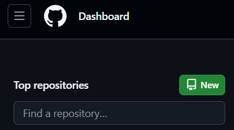

# Bienvenidos a la página de Apuntes de _"Llenguatge de marques"_

Unai Bueno Bravo

ASIX1

# Aprendizaje

# Aprendizaje_markdown
## Segundo nivel de encabezado
### Tercer nivel de encabezado
#### Cuarto nivel de encabezado
##### Quinto nivel de encabezado

Estos son los apuntes del *0373* del ciclo de _ASIX_ o **DAW** del curso __2425__

Primera clase **_markdown_** y HTML pueden anidarse

1. Primer punto de la lista
    1. Primer elemento de la sublista 1
    2. Segundo elemento de la sublista 2
2. Segundo punto de la lista
    * Primer elemento de la sublista 1
    * Segundo elemento de la sublista 2
3. Tercer punto de la lista

* Primer punto de lista desordenada
- Segundo punto de lista desordenada
+ Tercer punto de lista desordenada

lorem ipsum

Lorem Ipsum

**Como Mostrar cogido en un repositorio**
... html 5

...

### InsertarEnlace
[TextoClicable](https://unaibuenobravo.github.io/aprendizaje/ "Vuelta a la página")

[Página web de Jesuites Bellvitge](https://www.fje.edu/ca/jesuites-bellvitge "Titulo opcional")

### Como poner una imagen

|Titulo 1 | Titulo 2 | Titulo 3 |
|----------| :----------: | ----------:|
|SMX2 | Curso 2324|25|
|**ASIX**|Curso 2425|26|
|DAW2|Curso 2425|32|

# Como crear un _Repositorio_

1. Desde la página principal de GitHub, hacemos un __click__ *New* 

2. Personalización del Repositorio
    + __Nombre Repositorio__: Pondremos el nombre que deseemos al repositorio.
    + __Descripción__: Podemos agregar una descripción, si lo deseamos.
    + __Público__: Esta opción nos permite hacerlo publico o privado. La opción publico nos permite que sea accesible a todo mundo, el privado en cambio nunca lo va a hacer visble a los demás. 
    + __Add Readme__: SIEMPRE, vamos a añadir el archivo readme, nos permite hacer la sincronización de nuestro repositorio de forma más sencilla y eficaz.

    
    + Si "escrolleamos" un poquito para abajo veremos la opción que nos va a permitir crear el repositorio.
    
    

    # Comandos principales de GitHub

- git clone url => clonar repositorio
- git init => Inicializa/reinicia el repositorio
- git branch => para ver donde esta la raiz
- git branch -M main => ponemos la raiz en main
- git add README.md => Poner en zona intermedia (para añadir el git de internet) el readme.md
- git add . => Poner TODO en la zona intermedia
- git commit (-m) "comentario" => Subimos el archivo a la zona intermedia DEBMOS DE REVISAR QUE LO SUBA EN MAIN
- git push origin main => subimos ruta
- git push -u origin main
- git remote add (se genera main automatico) origin URL
- git pull => baja el archivo a local

[Creación apuntes HTML - 14/11/2024 18:19.]: #

# APUNTES HTML

En este documuento, vamos a organizar todos los elementos importantes a la hora de picar codigo en html.
Creo que es conveniente que los separemos en tres grandes bloques. 
Distinguiendo entre:

## Día 1 de apuntes HTML - Páginas

1. Elementos Grandes
    - html 5 ==> Estructura base html.
    - head ==> Reside información del documento y se navega por el, aunque no se vea en la misma página. 
    - link ==> Nos sirve para "linkear" otras páginas o documentos.
    - title ==> Breve desripción que identifica la página.
    - body ==> Reside información del documento.
    - div ==> Divisiones del contenido de la página.
    - h1 ==> Titulo con estilo 1.
    - h2 ==> Titulo con estilo 2.
    - h3 ==> Titulo con estilo 3.
    - li ==> Especifican los items de la lista.
    - ul ==> Lista desordenada.
    - ol ==> Lista ordenada.
    - a ==>  Crea enlaces internos o externos, archivos, ubicaciones, direcciones de correo, cualquier otra URL.
    - p ==> Parrafo.
    - img ==> Insertar una imagen.
    - br ==> Salto de espacio.
    - hr ==> Linea separadora. 
    

2. Elementos Medianos
    - content
    - rel ==> Nos permite relacionar, generlamente páginas. 
    - href ==> Enlazar elementos internos o externos.
    - id ==> Nombrar a ese elemento (lo podemos usar en cualquier elemento para "etiquetarlo").
    - src ==> Pondremos la ruta donde queramos insertar aquella imagen o documento. 
    - type ==> Nos determina el tipo de entrada que vamos a utilizar.
    - alt ==> En caso de error veremos el contenido que se introduzca.

3. Elementos más bien gráficos
    - strong ==> Texto en negrita
    - em ==> Texto en cursiva
    - u ==> Texto subrayado
    - width ==> Ancho
    - height ==> Alto

[Actualización apuntes HTML - 14/11/2024 19:03.]: #

## Día 2 de apuntes HTML - Formularios

1. Elementos/Atributos Grandes
    - form ==> Formato de formulario. Normalmente se linea a un php. 
    - label ==> El label nos sirve como si fuese un "p", pero lo podemos relacionar con otro elemento, como puede ser un "input".
     - for ==> Nos permite indicar hacia donde mirar
    - input ==> El input principalmente recaba datos, con diferentes formas para hacerlo. 
    - fieldset ==> Fieldset nos permite añadir una línea alredor del texto
    - legend ==> Nos pemite añadir un título al "fieldset". 
    - select ==> Nos permite añadir varias opciones a seleccionar. 
    - option ==> Es la herramienta que nos va a permitir añadir las opciones. 
    - textarea ==> Nos permite añadir un campo donde el usuario puede añadir un comentario. 
    - button ==> Nos permite añadir un boto. 

2. Elementos/Atributos Medianos
    - action ==> Definde la URL donde se enviaran los datos de los formularios.
    - method ==> Metodo de envio de datos.
        - get ==> de forma insegura.
        - post ==> de forma segura.
    - name ==> Nombre del campo de entrada. 
    - placeholder ==> Texto que aparece en el campo cuando esta vacío. 
    - target ==> Indico donde se debe de mostrar la respuesta del formulario.
        - _self ==> La respuesta se carga en la misma ventana.
        - _blank ==> Abre respuesta en nueva ventana.
    - value => Valor predeterminado campo de entrada.
    - select ==> Formato de la opción. En este caso de selección. 
    - requiered ==> Indica que el campo debe de compltearse. 
    - disabled ==> Desactiva el campo. 
    - Readonly ==> Hace que el campo solo sea de lectura. 
    - cols ==> Caractares disponibles.
    - rows ==> Filas máximas.
    